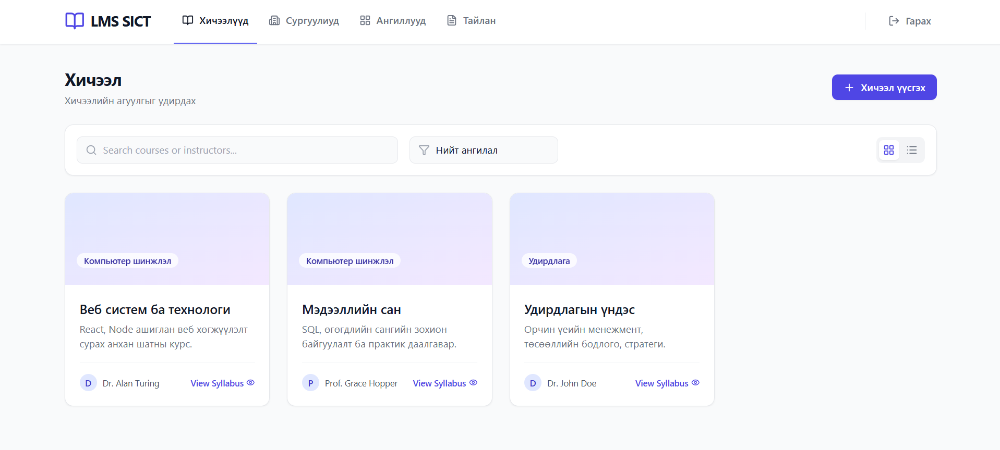
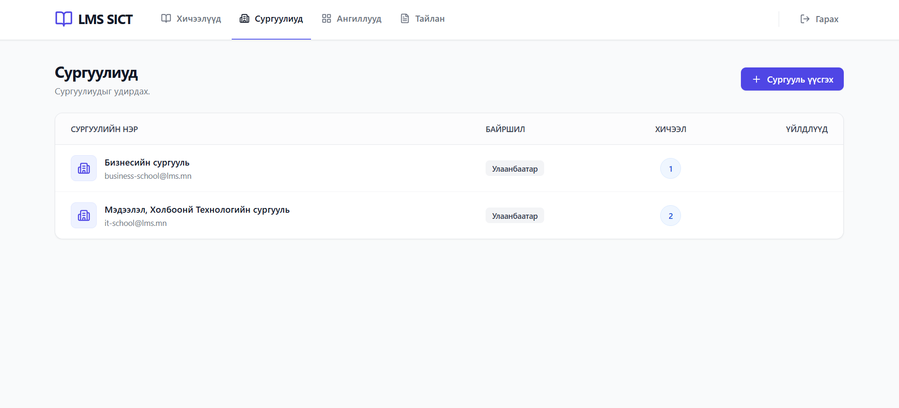
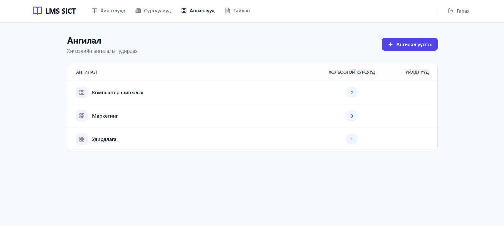
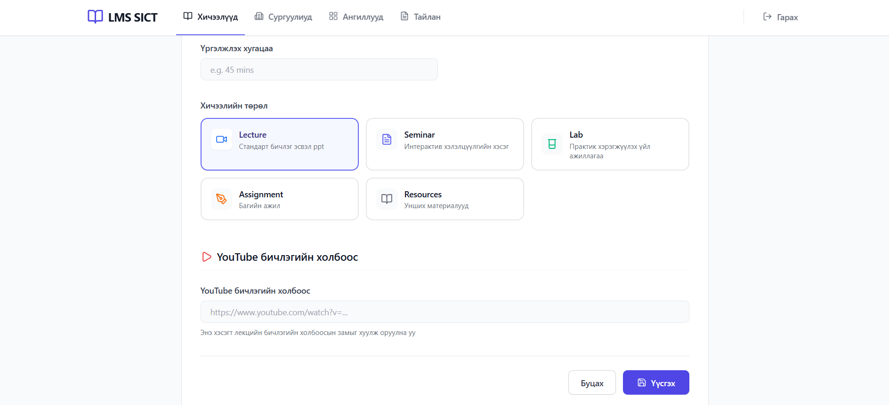

# LMS Project — Learning Management System

A full-stack web app built with React and Node.js/Express for my Web Systems & Technologies (ITM301) class. It lets schools and educators manage courses, lessons, and learning materials in one place.

---

## What it does

- **Course Management** — create, edit, and organize courses by school and category
- **Lesson Management** — structure lessons by type (Lecture, Seminar, Lab, Assignment)
- **Drag & Drop** — reorder lessons by dragging them around
- **YouTube Integration** — paste a YouTube URL and it automatically embeds the video
- **Attachments** — attach supporting materials to any lesson
- **Login System** — token-based authentication with different user roles
- **Responsive UI** — works on both mobile and desktop (Tailwind CSS)
- **Caching** — uses localStorage to cache data and keep things fast

---

## Screenshots






---

## Built with

**Frontend**
- React 19
- React Router DOM 7
- Tailwind CSS
- Lucide React (icons)
- React DnD (drag and drop)
- Axios

**Backend**
- Node.js
- Express 5
- Nodemon

---

## Project structure

```
lms-project/
├── backend/
│   └── src/
│       ├── controllers/
│       ├── routes/
│       ├── middleware/
│       └── data/
└── frontend/
    └── src/
        ├── components/
        ├── pages/
        ├── context/
        └── utils/
```

---

## Notes

- Data is stored in-memory (resets on server restart) — no real database connected yet
- Authentication is token-based but passwords aren't hashed (demo only)
- File uploads are UI-only for now

---

## About

Built as a team project for the **ITM301 Web Systems & Technologies** course.